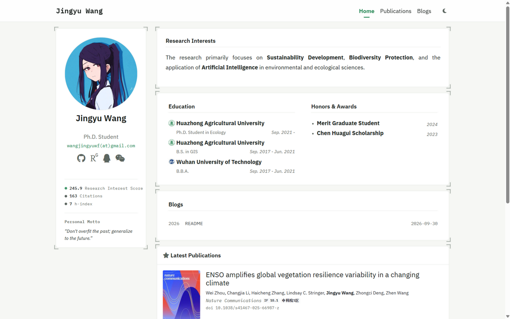

# Jingyu Wang — Academic Homepage

[](https://github.com/JackWoods-code/JackWoods-code.github.io/actions/workflows/jekyll.yml)

个人学术主页：论文、博文与研究兴趣。**线上访问：https://jackwoods-code.github.io/**



## 代码来源

本站基于 [luost26/academic-homepage](https://github.com/luost26/academic-homepage)（Jekyll + Bootstrap 4 的个人学术主页模板，MIT License）fork 并深度定制。

保留了模板的核心骨架：

- 出版物数据模型（`_publications/` front matter 驱动）与 widget 化布局（profile / news / publication 卡片）
- 博客系统、懒加载与 masonry 瀑布流
- Semantic Scholar 引用计数脚本、主题切换（浅色/深色）

感谢原作者 [Shitong Luo](https://luost.me/) 与模板社区的工作，原模板 demo 见 [luost26.github.io/academic-homepage](https://luost26.github.io/academic-homepage/)。

## 本仓库的主要修改

### 视觉重设计（Field Station 设计语言）

- 字体体系换为 IBM Plex Sans / IBM Plex Mono
- 全套设计 token：浅色纸面 `#F6F7F4` + 叶绿 `#0E7B43`，深色 `#0D110E` + 磷光绿 `#3DC97E`，并修复原深色模式对比度不足的问题
- 面板化视觉：发丝线边框 + 四角取景框刻度（全站唯一的装饰元素）
- 首页重排：hero 去卡片化、研究兴趣独立面板、观测铭牌（ResearchGate 三项指标）与 Personal Motto
- Publications 学术时间轴重构：随滚动绘制的竖向轴线、年份节点、点线年份导航（scrollspy）
- 404 终端彩蛋页（打字机动效）
- 移动端论文卡封面改为顶部横幅，不再作为文字底图

### 功能增强

- 论文条目：DOI 行、期刊度量徽章（IF / 中科院分区，来自 `_publications` front matter 的 `journal_if` / `cas_partition` 字段）
- 摘要：两端对齐 + 4 行截断 + `[+] expand / [−] collapse` 展开动画
- 引用数徽章：配置 `semantic_scholar_id` 后显示，数字从 0 滚动到位（当前论文均未配置，功能休眠中）
- Blogs：文章置顶（localStorage，仅本浏览器生效）、上一篇/下一篇导航
- 动效层 `assets/js/motion.js`：首页面板依次上电、时间轴滚动画线、区块滚动揭示、面板悬停刻度外扩、链接下划线滑入、主题图标翻转、跨文档 View Transitions

  > 全部动效带三重安全网：无 JS 时内容完整可见（`.js` 门控）、`prefers-reduced-motion` 时全部关闭、动效脚本加载失败时自动还原显示。

### Bug 修复（原模板问题）

- 博文页深色模式失效：`blog_post.html` 布局缺失主题切换与防闪烁脚本，已补齐
- `blog.css` 硬编码浅色值导致深色模式下排版异常，已 token 化
- 导航悬停时字重跳变引起文字回流抖动，已移除
- 列表页滚动到底部时右侧年份导航停留在上一年份的 scrollspy 问题，已修复

### 工程与部署

- GitHub Actions 自动部署（`.github/workflows/jekyll.yml`），push 到 `main` 即上线
- 清理模板演示内容（假新闻、demo 博文、Showcase 示例卡片）
- `Blogs/` 为本地手稿目录，已加入 `.gitignore` 与 Jekyll `exclude`，不入库、不上线

## 内容维护速查

- **加论文**：在 `_publications/` 新建条目，front matter 字段对照现有 8 篇（标题、作者、venue、日期、DOI 链接、封面、`journal_if`、`cas_partition`；可选 `semantic_scholar_id` 启用引用徽章）
- **加博文**：在 `_posts/` 新建 `YYYY-MM-DD-slug.md`；本地草稿可先放 `Blogs/`（不参与构建），定稿后移入 `_posts/`
- 期刊度量数据（IF / 分区）需每年自行更新

## 本地开发与部署

```bash
bundle install
bundle exec jekyll serve   # http://127.0.0.1:4000
```

- 推送到 `main` 后 GitHub Actions 自动构建并部署到 GitHub Pages
- 注意：本地若用纯静态服务器（如 `python -m http.server`）预览构建产物，`/publications` 这类无扩展名的导航地址会 404——GitHub Pages 自带 clean URL 解析，线上无此问题

## License

[MIT](LICENSE) © 2024 Shitong Luo（原模板）；本仓库的修改部分 © 2026 Jingyu Wang。
